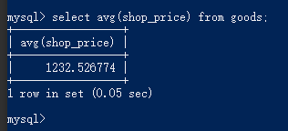
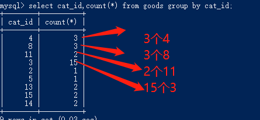
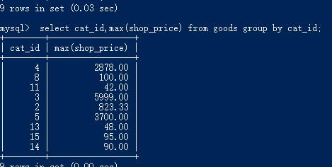

# sails 项目

（1）sails 全局安装

```
npm install sails -g
```

(2)创建项目

```
sails new server-sails
```

(3)进入刚才新建项目的目录

```
cd server-sails
```

(4) 启动项目

```
node app.js 或者 sails lift
```

（5）安装 mysql 模块

```
npm install sails-mysql --save
```

# 命令行生成路由

user 为 controller 名,zhuce 和 login 是方法名

```
sails generate controller user zhuce login
```

## 渲染页面:

```
module.exports={
   zhuce: function(req, res) {
        res.send(req.body)
    },
  login:function(req,res){
    res.send('这是我要输出的内容')
  }
```

# 通过路由 查找内容

生成文件的快捷方法 在命令行输入: sails generate controller box/user zhuce login

```
http://localhost:1337/user/login
```


## 在 url 里输入内容


# 返回给前端的内容 res.send(req.body)

```
module.exports={
   zhuce: function(req, res) {
        res.send(req.body)
    },
}
```

# 利用 vscode 调试页面


2 现在匹配

5 启动会报错是路径的问题

6 我们从新修改一下路径


7 请注意 如何开着 node app.js 就无法打开控制台调试所以我们要关闭 node app.js 后再打开调试功能

# 从前台 post 提交数据到后端返回数据流程

### （1）web\src\components\login.vue 前端提交数据到 vuex 里面


### （2）web\src\store\modules\login\user.js 的 vuex 管理


### （3）web\src\api\login.js 发起请求


### （4）web\src\api\server.ip.js 配置动态路由


### （5）web\src\utils\httpAxios.js 发起 ajax 请求


### （6）server-sails\config\cors.js 解决跨域


### （7）server-sails\api\controllers\UserController.js 接收内容返回给前端


### （8）web\src\store\modules\login\user.js 前端接收参数


### （9）web\src\store\modules\login\user.js 把返回值返给 login 页面


### （11）web\src\components\login.vue 前端接收返回值，绑定模板


### 对Params的封装 如果是两个插mysql的时候需要
 下载 "q": "^1.5.0", 连接前后台 cnpm install

```
 "q": "^1.5.0",
//引入
var Q = require('q');

//创建
 var defer = Q.defer();

//失败
 defer.reject(err);

//成功
  defer.resolve({
    resultCode: 0,
    msg: '已经被注册了',
  });
```

# 启动数据库 (必须是管理员身份启动)


### （1）启动数据库 net start mysql


### (2)关闭数据库 net stop mysql

### (3)连接数据库 mysql -u root -p

### mysql 登录密码：123456


### Navicat for Mysql 密码：123456

# 连接数据库流程图


# 安装 sails-mysql 数据库

(1) 安装

```
cnpm i sails-mysql --save
```

（2）server-sails/config/connections.js 数据库设置

```
  someMongodbServer: {
      adapter: 'sails-mysql',
      host: '127.0.0.1',
      port: 3306,
      user: 'root', //optional
      password: '123456', //optional
      database: 'sails_data' //数据库的名字
  },
```

（3）server-sails\api\models\User.js 修改数据库配置

```
module.exports = {
    tableName: 'user',
    adapter: 'mysql',
    autoCreatedAt: false,
    autoUpdatedAt: false,
    attributes: {
        Id: {},
        username: {},
        password: {},
        code: {},
    }
}
```

（4）server-sails/config/models.js 修改参数配置, safe 开发人员管理所有模式重构

```
 connection: 'someMongodbServer',

 migrate: 'safe'
```

(5) 引入到 UserController.js 里面 和 插入数据库

```
 let userInfo = req.allParams()
  User.create(userInfo).exec(function(err, created) {
      console.log(err);
      console.log(created); //返回的是创建的对象
  })
```

# mySql 命令行敲代码，

(1)显示所有数据库

```
show databases;
```


(2)进入某一个数据库,显示列表(table)内容

```
use sails_data;
show tables;
```


## 表(table)与库(databases)的概念

```
show databases;
```

## 查询某一张表

```
select * from user;
```


## 查看表属性

```
desc user;
```


# insert 操作

- 插入内容，列和值是严格对应的，
- 字符串必须加单引号
- 数字不必加单引号

```
 insert into user (uid,name,age)values(1,'lisi',23);
```

## 插入多条数据

```
insert into user (username,password,code)values('ww','ww','ww');
```

# update 修改

## 表中 password =“ww” 的username改成 eeee

```
update user set username='eeee' where password='ww';
```

## 把 id=12 的修改成 username='1233',password='444';

```
 update user set username='1233',password='444' where Id=12;
```

# delete 删除

## 删除 Id=12 的

```
delete from user where Id=12;
```

# 查询有五种语句（where,group,having,order by,limit）
## （1）where语句
## 查询 uid =2 的这条数据

```
select * from user where uid =2;
```

## \* 代表所有列，我们只查询 uid,name 列,uid 大于等于 2 的

```
select uid,name from user where uid>=2
```

## 查询为真 true 取出来

```
select * from user where 1;
```

## 取出Id= 4 和 Id=11 的（ Id，usernam，password）信息

```
select Id ,username,password from user where Id=2 or Id=13;
```
## null 的应用
* null 代表没有值，好比我们都没有农行账户，我们比较一下谁在农行更有钱，没法比，null 不等于null
* 查询表里等于null的
```
select * from user where password is null;
```
查询表里不等于null
```
select * from user where password is not null;
```
## (2) group分组和统计函数
* max(), 求最多
* count(),求个数
* avg(), 求平均数
* min(), 求最小
* sum()，求总和
```
 select max(shop_price) from goods;
 select count(shop_price) from goods;
 select avg(shop_price) from goods;
 select min(shop_price) from goods;
 select sum(shop_price) from goods;
```


## 进行分组
统计个数
```
select cat_id,count(*) from goods group by cat_id;
```


## 查询每组中shop_price最大的， cat_id 是一样的是一组
```
select cat_id,max(shop_price) from goods group by cat_id;
```


## 