# sails项目
（1）sails全局安装

```
npm install sails -g
```
(2)创建项目
```
sails new server-sails
```
(3)进入刚才新建项目的目录
```
cd server-sails
```
(4) 启动项目
```
node app.js 或者 sails lift
```
（5）安装mysql模块
```
npm install sails-mysql --save 
```

# 命令行生成路由
user为controller名,zhuce和login是方法名 
```
sails generate controller user zhuce login  
```
## 渲染页面:
```
module.exports={ 
   zhuce: function(req, res) {
        res.send(req.body)
    },
  login:function(req,res){ 
    res.send('这是我要输出的内容')
  } 
```
# 通过路由 查找内容
生成文件的快捷方法 在命令行输入: sails generate controller box/user zhuce login
```
http://localhost:1337/user/login
```
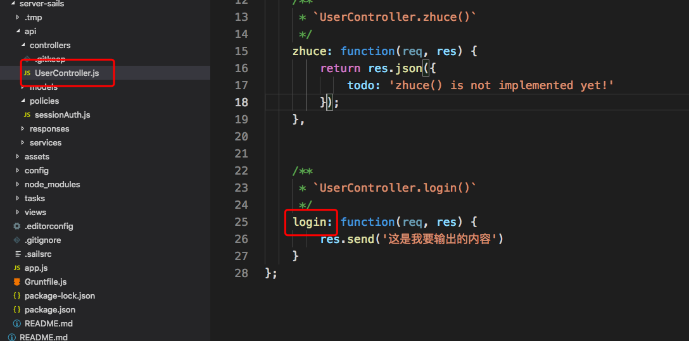
## 在url里输入内容
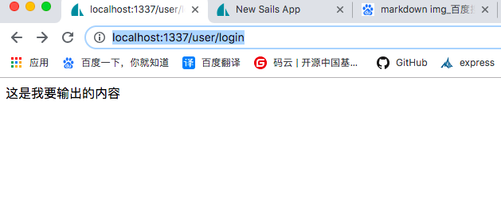

# 返回给前端的内容  res.send(req.body)
```
module.exports={ 
   zhuce: function(req, res) {
        res.send(req.body)
    },
}
```


# 利用vscode调试页面


2现在匹配
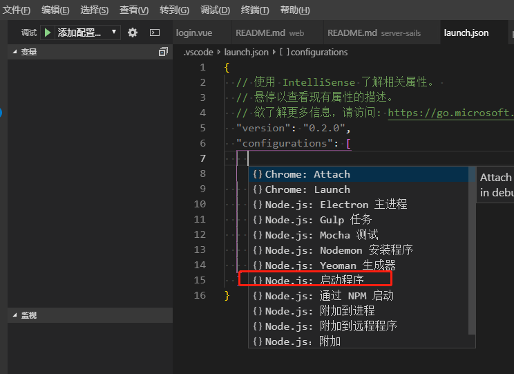
5启动会报错是路径的问题
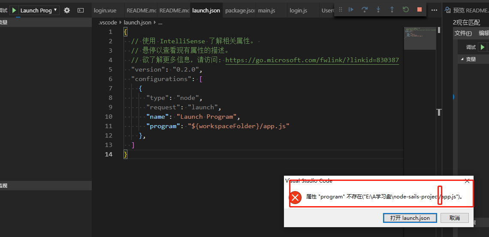
6我们从新修改一下路径
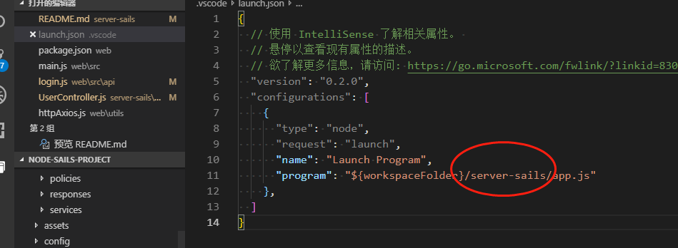

7请注意 如何开着 node app.js 就无法打开控制台调试所以我们要关闭node app.js后再打开调试功能


# 从前台post提交数据到后端返回数据流程
  
### （1）web\src\components\login.vue前端提交数据到vuex里面
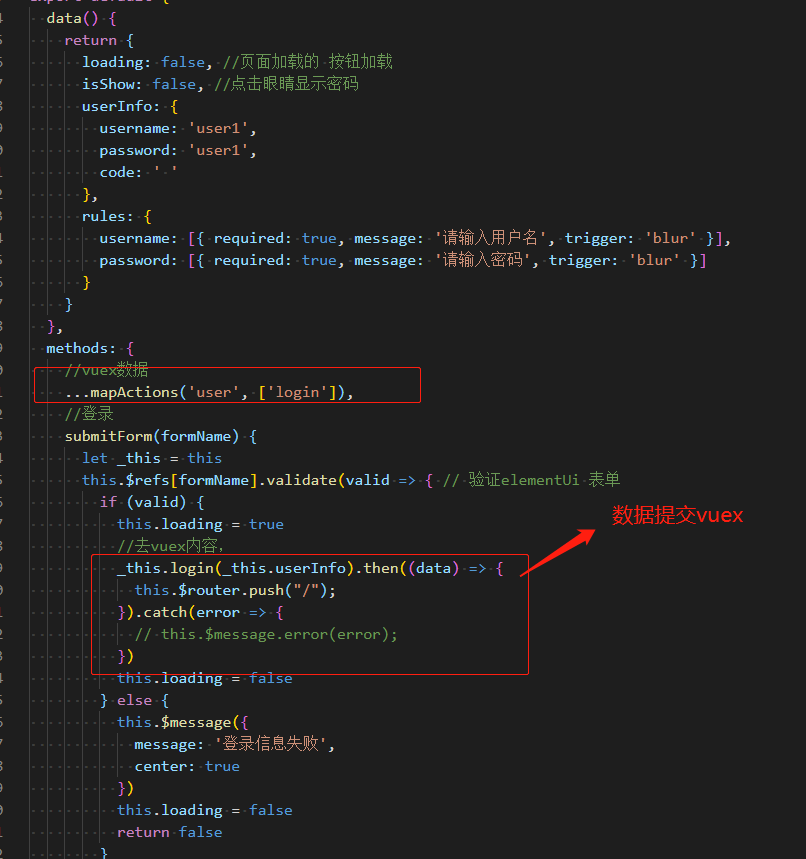

### （2）web\src\store\modules\login\user.js 的vuex管理
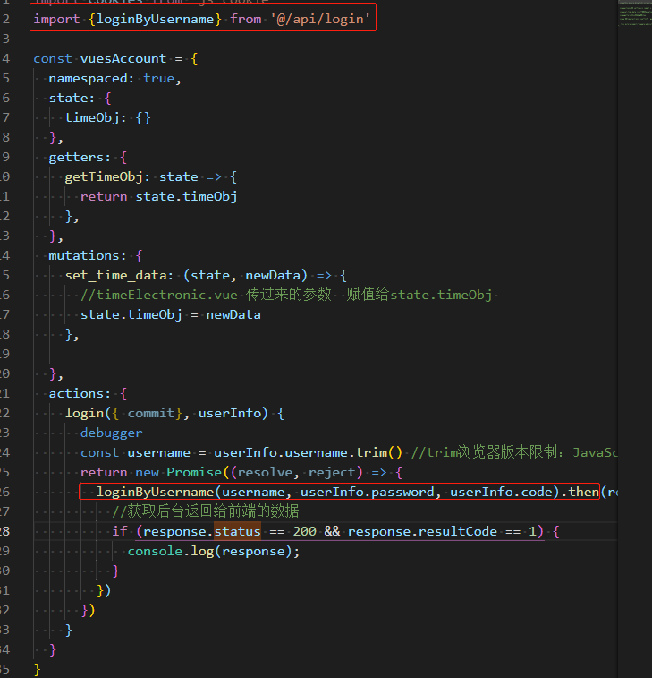
### （3）web\src\api\login.js 发起请求
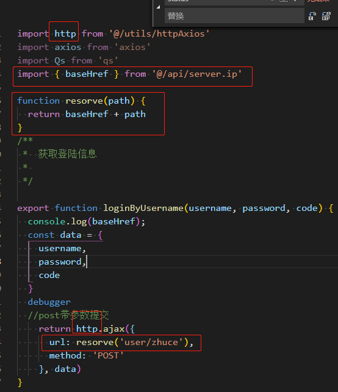
### （4）web\src\api\server.ip.js配置动态路由
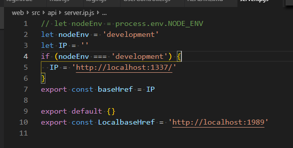
### （5）web\src\utils\httpAxios.js发起ajax请求
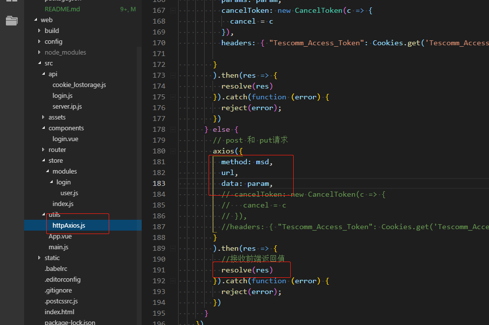
### （6）server-sails\config\cors.js 解决跨域
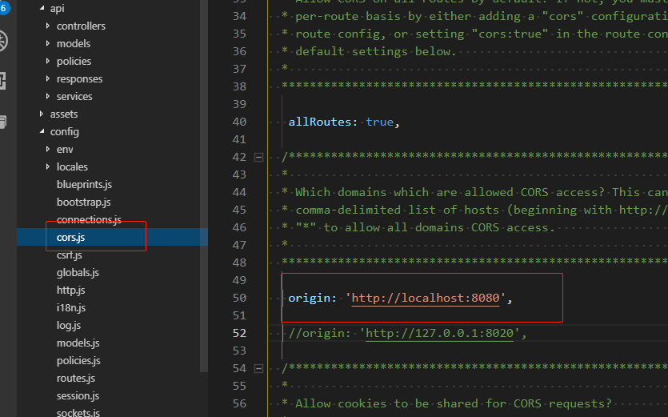
### （7）server-sails\api\controllers\UserController.js接收内容返回给前端
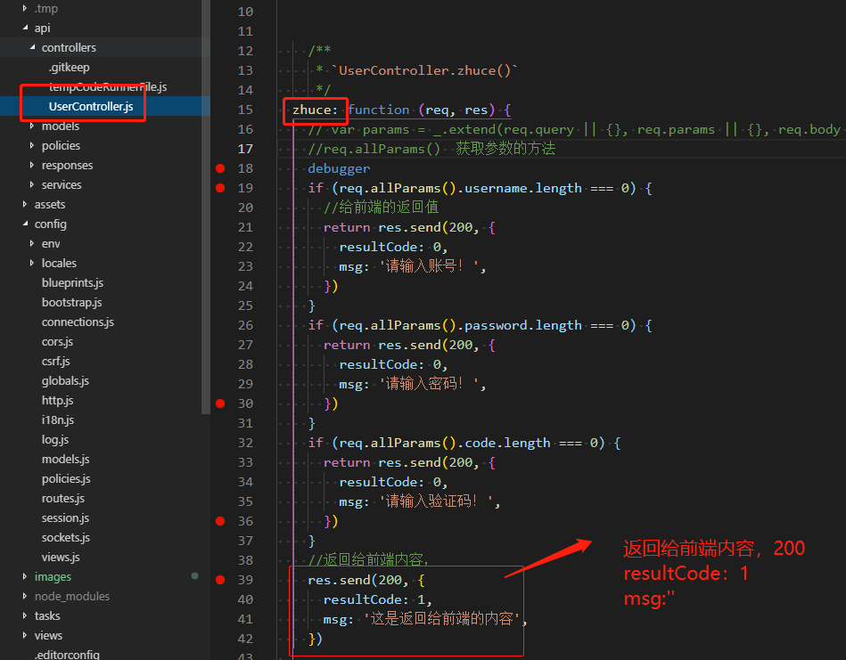
### （8）web\src\store\modules\login\user.js前端接收参数
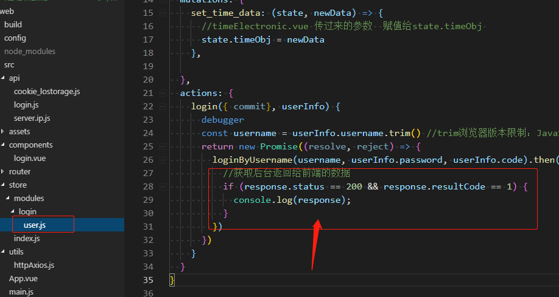
### （9）web\src\store\modules\login\user.js把返回值返给login页面
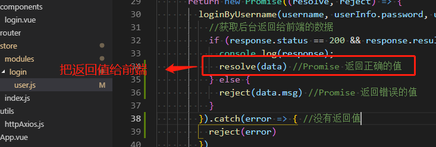
### （11）web\src\components\login.vue前端接收返回值，绑定模板
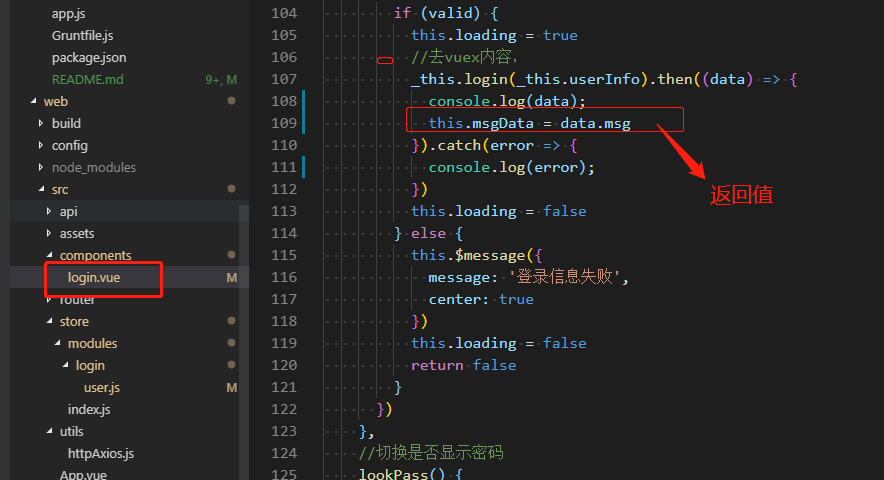

# 启动数据库 (必须是管理员身份启动)
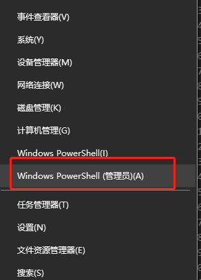
### （1）启动数据库 net start mysql
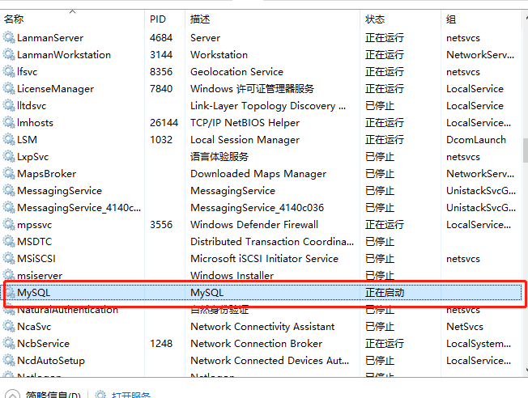

### (2)关闭数据库 net stop mysql

### (3)连接数据库  mysql -u root -p
### mysql登录密码：123456
### mac的苹果本mysql登录密码：13520326071

### Navicat for Mysql密码：123456

# 连接数据库流程图
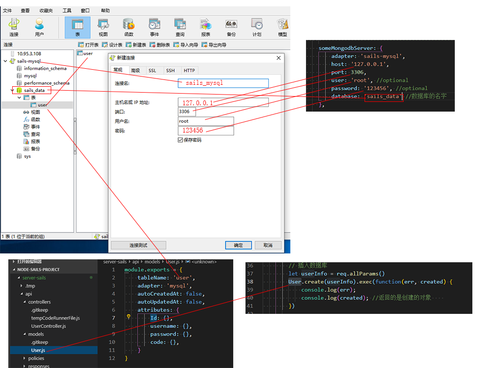

# 安装sails-mysql数据库
(1) 安装
```
cnpm i sails-mysql --save
```
（2）server-sails/config/connections.js数据库设置
```
  someMongodbServer: {
      adapter: 'sails-mysql',
      host: '127.0.0.1',
      port: 3306,
      user: 'root', //optional
      password: '123456', //optional
      database: 'sails_data' //数据库的名字
  },
```
（3）server-sails\api\models\User.js 修改数据库配置
```
module.exports = {
    tableName: 'user',
    adapter: 'mysql',
    autoCreatedAt: false,
    autoUpdatedAt: false,
    attributes: {
        Id: {},
        username: {},
        password: {},
        code: {},
    }
}
```
（4）server-sails/config/models.js 修改参数配置, safe 开发人员管理所有模式重构
```
 connection: 'someMongodbServer',

 migrate: 'safe'
```

(5) 引入到UserController.js里面 和   插入数据库
```
 let userInfo = req.allParams()
  User.create(userInfo).exec(function(err, created) {
      console.log(err);
      console.log(created); //返回的是创建的对象    
  })
```

# mySql命令行敲代码，
 (1)显示所有数据库
```
show databases;
```
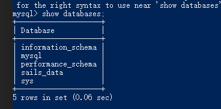

 (2)进入某一个数据库,显示列表(table)内容
```
use sails_data;
show tables;
```
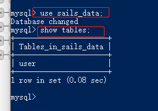


 ## 表(table)与库(databases)的概念
```
show databases;
```
 ## 查询某一张表
```
select * from user;
```
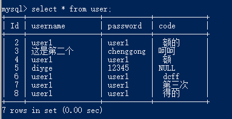

## 查看表属性
```
desc user;
```
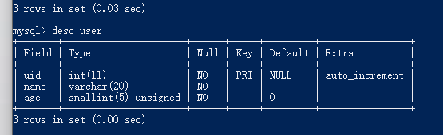

## insert 操作
* 插入内容，列和值是严格对应的，
* 字符串必须加单引号
* 数字不必加单引号
```
 insert into user (uid,name,age)values(1,'lisi',23);
```