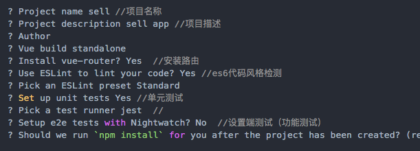

mac 下全局安装

```
sudo npm install -g vue-cli
```

web 为你自己新建项目的名称

```
vue init webpack web
```


进入项目

```
cd web
```

下载引用

```
npm install
```

启动前端

```
npm run dev
```

# 从前端到数据库流程

(1)在 login 页面创建表单，发起 ajax 请求，

```
  methods: {
    //vuex数据
     ...mapActions('user', ['login']),
    onSubmit(formName) {
      let _this = this;
      _this.$refs[formName].validate((valid, obj) => {
        if (valid) {
          _this.login(_this.userInfo).then((data) => {
            console.log('前端推送到后台的返回值');
          }).catch(error => {
          })
        } else {
          return false;
        }
      });
    },
  }
```
(2) 安装vuex
```
cnpm install vuex --save
```
(3) 在根路径创建store\index.js
```
import Vue from 'vue'
import logger from 'vuex/dist/logger' //导出日志
import Vuex from 'vuex'
import user from './modules/login/user'
Vue.use(Vuex)

// 除了 state 是分模块的，其他 mutations 和 actions 都不分模块，因此规划的时候要注意不要重名！
const store = new Vuex.Store({
  strict:true, //严格模式只能通过，mutation来修改状态，mutation不支持异步，
  plugins:[logger()], //日志插件
  modules: {
    user, //获取登录的信息
  },
  // plugins: [vuexLocal.plugin]
})

export default store
```
(4)在main中讲store 引入
```
import store from './store' //vuex
new Vue({
  el: '#app',
  router,
  store,
  components: { App },
  template: '<App/>'
})
```

(5) 在根目录下创建 store\modules\login\user.js接收传过来的参数
```
  actions: {
    login({ commit}, userInfo) {
      debugger
     .then(response => {
      //     const data = response
      //   })
      // })
    }
  }

```
(6)将内容发给web\api\login.js 页面发起ajax请求
```
import {loginByUsername} from '@/api/login'
 actions: {
    login({ commit}, userInfo) {
      debugger
      const username = userInfo.username.trim() //trim浏览器版本限制：JavaScript Version 1.8
       return new Promise((resolve, reject) => {
         loginByUsername(username, userInfo.password, userInfo.code).then(response => {
           const data = response
         })
       })
    }
  }
```
(7)下载 axios
```
npm install axios --save
```


# 向vuex传参数的多种方法
```

```
